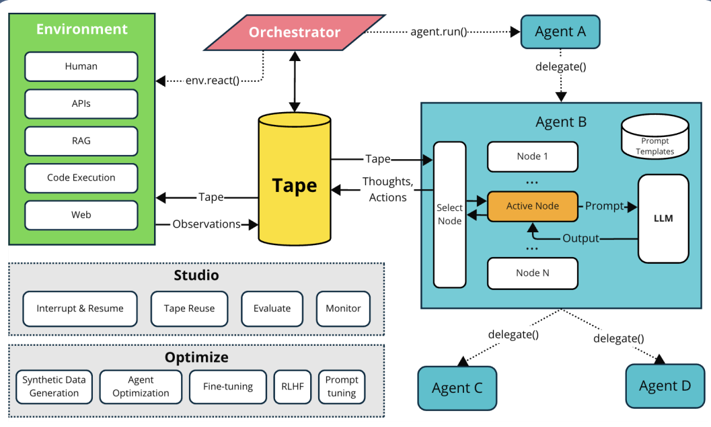

## Agents for Enterprise Workflows

### Outline

- Background: Define Agents, Enterprise workflow concepts

- API Agents: Architecture, TapeAgents

- Web Agents: Web Agent Concepts, WorkArena, BrowserGym and AgentLab

- Agents in the workplace: Automating enterprise workflows, Agents and the future of work

- Resourcs to Dig further


### API Agents

[TapeAgents](github.com/ServiceNow/TapeAgents) is a hlistic framework for agent development and optimization. In fact, it combines AutoGen and DSPy.



> TapeAgents is designed around Tape, which records the entire agent session in a structured, replayable log. Below's an example:

```python
# Install tapeagents
!pip install 'tapeagents[converters,finetune]'
from tapeagents.agent import Agent, Node
from tapeagents.core import Prompt
from tapeagents.dialog_tape import AssistantStep, UserStep, DialogTape
from tapeagents.llms import LLMStream, LiteLLM
from tapeagents.prompting import tape_to_messages

llm = LiteLLM(model_name="gpt-4o-mini") # Initial a GPT-4o-mini

class MainNode(Node): # Define a node to generate prompt and output
    def make_prompt(self, agent: Agent, tape: DialogTape) -> Prompt:
        return Prompt(messages=tape_to_messages(tape)) # transfer a tape to message

    def generate_steps(self, agent: Agent, tape: DialogTape, llm_stream: LLMStream):
        yield AssistantStep(content=llm_stream.get_text())

agent = Agent[DialogTape].create(llm, nodes=[MainNode()]) # create agent

start_tape = DialogTape(steps=[UserStep(content="Tell me about Tampa in three sentences.")]) # Initial tape, with an function of the user input

# 运行代理，开始执行第一个节点，并获取最终磁带
final_tape = agent.run(start_tape).get_final_tape() # Run the agent and the first step than get the final tape

print(f"Final tape: {final_tape.model_dump_json(indent=2)}")
```


Output:
```python
Final tape: {
  "metadata": {
    "id": "b3bba7a6-b0be-4d7b-a54d-05e7da3823ed",
    "parent_id": "9f7e1967-0584-4ac5-b58f-601840340e40",
    "author": "Agent",
    "author_tape_id": null,
    "n_added_steps": 1,
    "error": null,
    "result": {}
  },
  "context": null,
  "steps": [
    {
      "metadata": {
        "id": "790bef38-f131-4d1e-a8d0-4e99184c67b9",
        "prompt_id": "",
        "node": "",
        "agent": "",
        "other": {}
      },
      "kind": "user",
      "content": "Tell me about Tampa in three sentences."
    },
    {
      "metadata": {
        "id": "bc1f0153-9ae3-40f0-983d-d7891fc96289",
        "prompt_id": "6ecc9620-11c8-406c-91bd-d20e5a0ae858",
        "node": "MainNode",
        "agent": "Agent",
        "other": {}
      },
      "kind": "assistant",
      "content": "Tampa is a vibrant city located on the Gulf Coast of Florida, known for its diverse culture, rich history, and thriving business environment. The city boasts attractions such as Busch Gardens, the Florida Aquarium, and a lively waterfront. With a warm climate and numerous outdoor activities, Tampa is a popular destination for both tourists and residents alike."
    }
  ]
}
```

For more instructions: https://github.com/ServiceNow/TapeAgents/blob/main/intro.ipynb

> 在我看来, TapeAgent的优势在与这是一个拥有完整链路调试工具的一个框架, 便于逐步扩展. 此外, agent每次代理执行时，Tape 会将用户输入、代理思考、操作、环境反馈等所有步骤都以结构化形式记录下来.


### Web Agents & Agents in the workplace

> 这一段听了听,分享为主,没怎么记..


