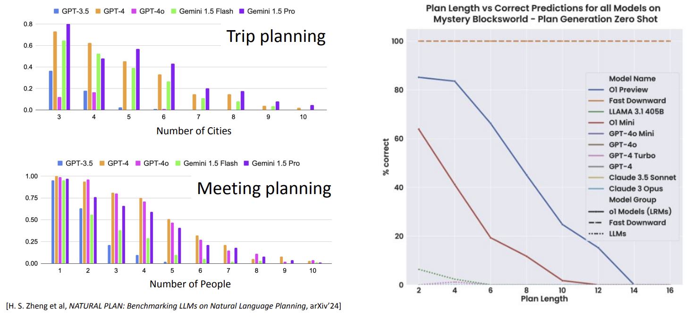
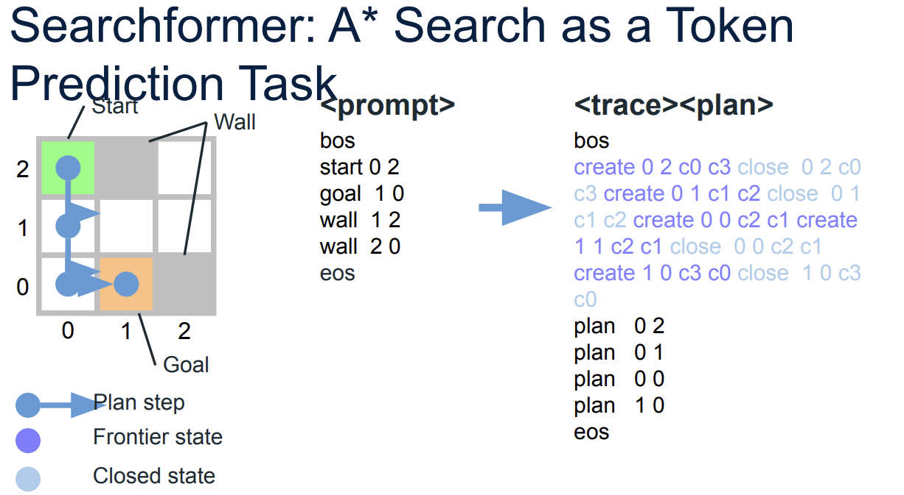
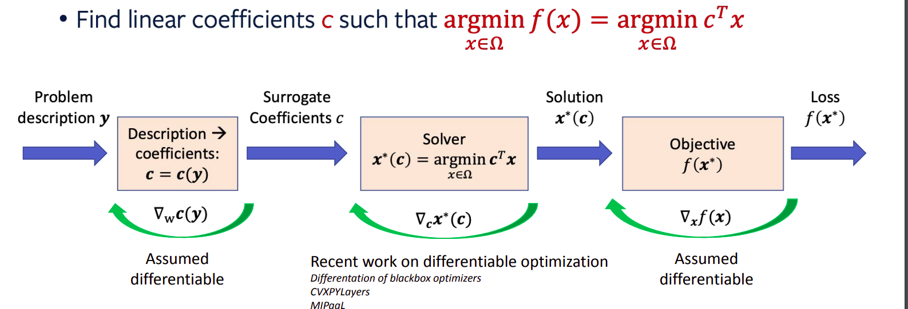

## Course 8: Towards a unified framework of Neural and Symbolic Decision Making

Reasoning & Planning

LLM planning is a hard problem



Solution:

1. The Scaling Law (larger model)

2. Hybrid Systems (Deep Model +_ Solver)


    1. Deep Models (use tools) -> Solver (: Towards Language-Driven Guaranteed Travel Planning (EMNLP’24 Demo)

        1. First, ask LLM to convert the natrual language into JSON file

        2. Augemented the data from fligh/hotel information from database

        3. Impose constraints and formalize the travel planning as Mixed Integer Linear Programming (MILP).

        4. Build a combinatorial solver to give optimal solution.

    2. Hybrid Systems: Use Solver to provide data to train the model better (Searchformer: A* search as a token prediction)

    > “Searchformer”提出了一个想法：
    > 把搜索的关键步骤都离散化为一系列的 token（标记）。 利用 Transformer 等语言模型去学习和生成这些 token。在传统的 A* 中，我们关心的是“最终找到的路径”；而在这里，研究者还关心“搜索过程中每一步发生了什么”。比如：
    > 
    > 1.什么时候“创建”了新节点（create）
    >
    > 2.什么时候“关闭”了某个节点（close）
    >
    > 3.哪些节点是从哪个父节点扩展出来的
    >
    > 4.最终的路径又是哪些节点串起来的
    >
    > 把这些操作或信息记录成一个序列，就像写一段文本：“先做什么，再做什么，最后得到结果”。

    

    ```python
    bos 
    create 0 2 c0 c3 close 0 2 c0 #选中 c0 进行扩展（因为它是唯一节点）。 发现了它的可行邻居：c3. 将 c0 从开放列表移除。
    c3 create 0 1 c1 c2 close 0 1 #选中 c3 进行扩展。发现 c1, c2 将 c3 移出开放列表、放入关闭列表。把 c1, c2 加入开放列表。
    c1 c2 create 0 0 c2 c1 create 1 1 c2 c1 close 0 0 c2 c1  #现在开放列表里有 c1 和 c2，c2 代价最小，就选 c2； 
    create 1 0 c3 c0 close 1 0 c3 c0 #到达终点
    plan 0 2
    plan 0 1
    plan 0 0
    plan 1 0 # 回溯得到一条路径
    ```

    Then introduce 2 kinds of training model, one is solution-only model and the other is search-augmented_model.

    **DualFormer (Searchformer v2)**

    > 在 Searchformer 中，模型始终需要输入或学习完整的搜索轨迹。在某些场景下，这会带来两方面的问题：
    >
    > 推理速度：如果要在推断时也“生成”所有中间搜索 token，可能会比较慢（“慢思考”）。
    > 
    > 训练多样性：只学习“完整轨迹”可能会导致模型对“有缺失或部分轨迹”的情况不够鲁棒。
    > 
    > DualFormer 的核心想法是：让同一个模型在训练时就接触到“不同程度完整度”的搜索轨迹（从完全保留到完全丢弃），从而在推断时可以“自如地”进行快思考（几乎不依赖搜索轨迹）和慢思考（完整利用搜索轨迹）两种模式，甚至中间形态都有可能。
    > 作者引入了一个随机化丢弃（drop）搜索轨迹的机制，不同的级别 (L1 ~ L4) 对搜索轨迹做不同程度的删减

    

    3. End to End (Train the model and the solver at the same time)

    - 深度模型用来预测或估计目标函数中的一些复杂非线性部分；
    - 然后将结果交给传统的组合优化求解器（如 MILP、ILP、SAT solver 等）来处理离散约束和搜索问题。

    Example:

    * 我们有 $k$ 张 embedding tables（如推荐系统中的嵌入表），以及 $n$ 个相同的设备（GPU 或服务器）。 每张表 $i$ 有内存需求 $m_i$；每个设备 $j$ 有内存容量 $M_j$。 我们需要把这些表分配到不同设备上，满足"总内存不能超过设备容量"的约束：$\sum_i x_{ij}m_i \leq M_j$。还要最小化系统的延迟（latency）。但延迟本身是一个复杂的非线性函数，可能取决于网络通信、batching、并发、缓存等。

3. 